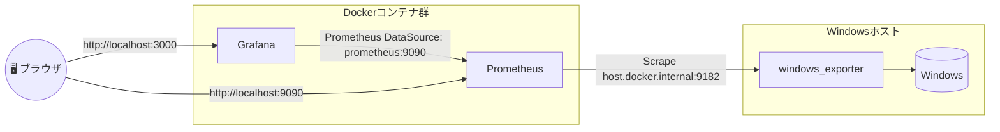

# 🧩 Windowsで学ぶ監視入門：Prometheus + Grafana + windows_exporter

このドキュメントでは、**Windows環境**で  
**Prometheus + Grafana + windows_exporter** をDocker Composeで動かし、  
監視の基本構造を理解できるようにします。

---

## ⚙️ 前提条件と推奨スペック

| 項目 | 最低構成 | 推奨構成 | 備考 |
|------|------------|------------|------|
| メモリ | 16GB | 32GB以上 | Prometheus/Grafana + Docker Desktop + WSL2が同時稼働 |
| CPU | 4コア以上 | 8コア以上 | DockerとWSL2が同時稼働 |
| OS | Windows 10/11 | Windows 11 最新版 | |
| 仮想化設定 | 有効（VT-x/AMD-V） | - | |

> ⚠️ **注意:** メモリが16GB未満だと、学習環境が安定しません。

---

## 🧭 構築イメージ



---

## 🧰 1. 環境準備

### 1-1. wingetでインストール

PowerShellを**管理者権限**で開いて実行：

```bash
winget install --id Microsoft.WSL
winget install --id Canonical.Ubuntu
winget install --id Microsoft.VisualStudioCode
winget install --id Docker.DockerDesktop
```

### 1-2. WSL2を初期化

```bash
wsl --install
wsl --set-default-version 2
```

Ubuntuがインストールされたら、ユーザー名とパスワードを設定。

---

## 🧩 2. プロジェクト作成（WSL上で実施）

Ubuntuを起動して：

```bash
cd ~
mkdir simple-prometheus-monitoring-setup
cd simple-prometheus-monitoring-setup
```

VSCodeで開く：

```bash
code .
```

> 💡 下のステータスバーに「WSL: Ubuntu」と出ていればOK。

---

## 📦 3. ディレクトリ構成

```
simple-prometheus-monitoring-setup/
├─ compose.yaml
└─ prometheus/
   └─ prometheus.yml
```

---

## 🖥️ 4. windows_exporterのセットアップ（v0.31.3対応）

### 4-1. ダウンロード

[windows_exporter Releases](https://github.com/prometheus-community/windows_exporter/releases)  
から最新版（例：`windows_exporter-0.31.3-amd64.msi`）を取得して実行。

### 4-2. インストール時の設定

| 設定項目 | 内容 |
|-----------|------|
| **Firewall Exception** | `Will be installed on a local hard drive.` を選択 |
| **Collectors** | `[defaults],cpu_info,time,hyperv,process` を追加 |

### 4-3. 動作確認

ブラウザで以下にアクセス：

```
http://localhost:9182/metrics
```

メトリクスが表示されれば成功です。

---

## ⚙️ 5. Prometheus設定

`prometheus/prometheus.yml`

```yaml
global:
  scrape_interval: 15s

scrape_configs:
  - job_name: "windows"
    static_configs:
      - targets: ["host.docker.internal:9182"]
```

---

## 🧱 6. compose.yaml

> 📝 **補足:** Docker Compose v2以降では `version:` は不要です。

```yaml
services:
  prometheus:
    image: prom/prometheus
    container_name: prometheus
    volumes:
      - ./prometheus/prometheus.yml:/etc/prometheus/prometheus.yml
    ports:
      - "9090:9090"

  grafana:
    image: grafana/grafana
    container_name: grafana
    ports:
      - "3000:3000"
    depends_on:
      - prometheus
```

---

## 🚀 7. コンテナの起動と停止

起動：

```bash
docker compose up -d
```

停止：

```bash
docker compose down
```

---

## 📊 8. Grafana設定（v9.5以降対応）

1. 左メニュー → **Connections → Data sources**
2. 「Add data source」→ **Prometheus** を選択
3. URLに `http://prometheus:9090`
4. 「Save & Test」クリック → ✅「Data source is working」

---

## 📈 9. ダッシュボードのインポート

1. 左メニュー → 「Dashboard」→「New」→「Import」
2. 「Grafana.com dashboard URL or ID」に `14694` を入力 →「Load」
3. 「Prometheus data source」を選択 →「Import」
4. Windowsの状態が把握できるダッシュボードが表示されます。

> 📝 **補足:** いくつかのパネルはデータが取れませんが正常です。

---

## 🧭 10. トラブルシューティング

| 症状 | 原因 | 対応策 |
|------|------|--------|
| PrometheusがDOWN | Firewallブロック | Firewall Exceptionを有効化 |
| メトリクスが少ない | Collectors不足 | `[defaults],cpu_info,time,hyperv,process` 追加 |
| Grafanaのダッシュボードのパネルが動作しない | ダッシュボードの設定値に問題 | パネルをEditして **Value options** の **Fields** に `Numeric Fields`を選択 |
| Grafanaのダッシュボードのパネルが動作しない2 | メトリクスが存在しない | クエリを調整する。Uptimeであれば下記に変更など。<br />`time() - process_start_time_seconds{instance="$server"}` |


---

## 🏁 まとめ

| コンポーネント | 役割 |
|----------------|------|
| windows_exporter | Windowsメトリクス収集 |
| Prometheus | メトリクス蓄積 |
| Grafana | 可視化 |
| Docker Compose | コンテナ管理 |
| WSL2 + VSCode | 開発環境 |

---

📘 本ドキュメントは ChatGPT (OpenAI GPT-5) の支援を受けて作成されています。
自由に学習・再利用してください。


